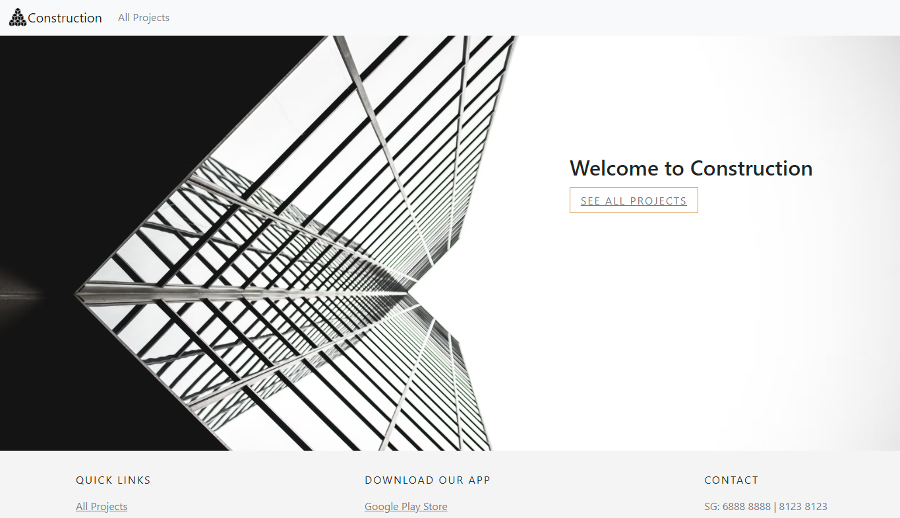

# Construction.
 

Access the live demo of the website [here](https://project260622.netlify.app/).

## Project Summary

**Project Context**

 _Construction_ is a mobile reponsive web application that focuses on construction project details.

## Features
1. **Main page**. User is able to see a call to action right at the landing page that will lead them to the project listing page.

2. **Multiselect Filter dropdown** This feature is used to narrow down the search results for the user. User can search for projects by the tags by clicking the respective options at the filter input.

3. **Search feature** The user is able to search by name and/or by the season's name. The search bar is placed in the navigation for quick access.

## Technologies Used
* [React.JS](https://reactjs.org/)
    * Front end framework used across the web app
    * React Hooks
* HTML5
    * To create the framework of the web app
* CSS3
    * To style various elements throughout the web app
* JavaScript
    * To include interactive elements throughout the web app
* [Bootstrap v5.0](https://getbootstrap.com/docs/5.0/getting-started/introduction/)
    * To create tabs
    * To create cards 
* [Flaticon](https://www.flaticon.com/)
    * For logo design
* [Git](https://git-scm.com/)
    * For version control
* [GitHub](http://github.com)
    * To create repository
* [Netlify](https://www.netlify.com/)
    * To deploy web app

## Deployment
The web app is hosted using Netlify.

**Dependencies**

* [Axios](https://cdnjs.com/libraries/axios)
    * To call API

## Credits

* Icons on the app
    * Downloaded and edited from [Flaticon](https://www.flaticon.com/)

* React Widget for dropdown list
    * React suite from [React Widget](https://jquense.github.io/react-widgets/docs/DropdownList/)

## Backend API service link

* [WaveScan](https://wavescan-frontend-assessment.saurabhmudgal.repl.co/)